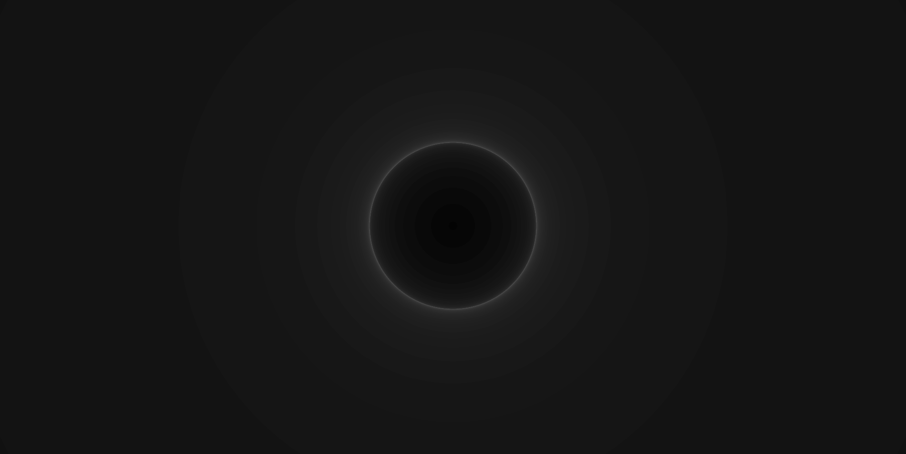
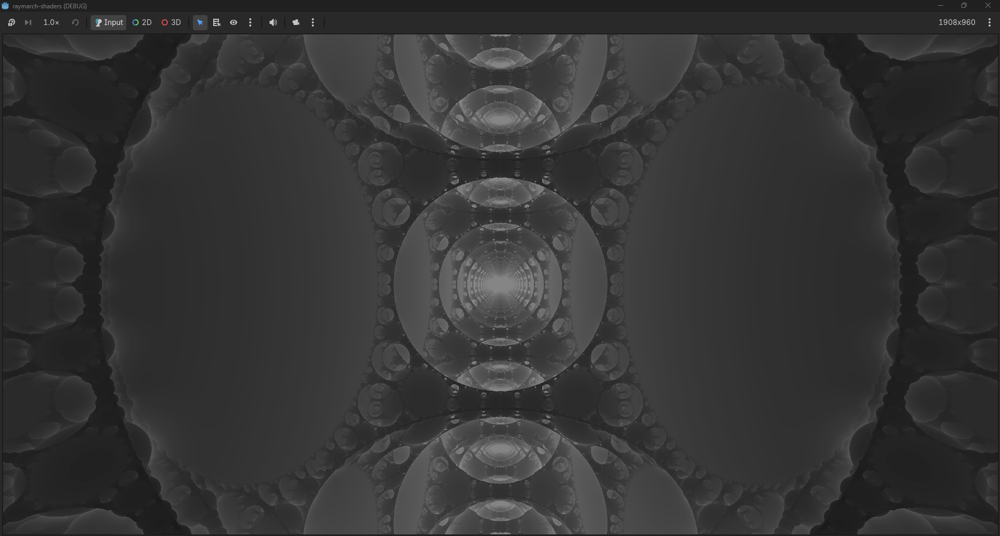

# godot-raymarch-shaders

Raymarching / SDF shaders in Godot 4

## Note:

I know very little linear algebra and I've only been working on shaders for about 2 months.
Some of the information in this repo may be inaccurate.

### Ray setup

```gdshader
vec3 ro = CAMERA_POSITION_WORLD; // camera position as ray origin

vec3 rd = normalize((INV_VIEW_MATRIX * vec4(VERTEX, 0.0)).xyz); 
 // Transform position of the fragment (pixel), in view space to a directional world space vector.

float t = 0.; // total ray distance travelled
```

### The march loop

```gdshader
 for (int i = 0; i < 80; i++){
	vec3 p = ro + rd * t; // this is what marches the ray. 
	
	float d = SdScene(p); // Signed distance map. 
						  // This can just be a primitive or multiple primitives using combinators.

	t += d; // march the ray length by its distance to the scene.

	ALBEDO = vec3(float(i)) / 80.; // This colors by steps. 
							       // since we step by distance, near miss rays will have more steps, 
								   // which creates a glowing effect.

	if (d < .001) break; // ray distance to sphere is so small we count it as a hit and break.
	if (t > 100.) break; // ray shot off into narnia, so break.

	// these early break conditions are good for performance, as well as coloring using the iteration count.
}
```

### SDFs

## Signed Distance Sphere:

```gdshader
length(point) - radius
``` 
returns the distance from a point to the origin minus the radius of the sphere.
positive values mean the point is outside of the sphere, negative means inside.



## Translating Distance Function:

https://github.com/user-attachments/assets/c282c089-4721-4cd3-a437-46ef0aa91ee1

## Signed Distance Fractals - From Jon Baker's SDF entries (https://jbaker.graphics/writings/DEC.html):

```gdshader
float de( vec3 p0 )
{
    vec4 p = vec4(p0, 1.);
    for(int i = 0; i < 8; i++){
      p.xyz = mod(p.xyz-1., 2.)-1.;
      p*=(1.2/dot(p.xyz,p.xyz));
    }
    p/=p.w;
    return abs(p.x)*0.25;
}
```



### Combinators (TODO)

### Normals / lighting (TODO)


## Reference

https://www.youtube.com/watch?v=khblXafu7iA - An introduction to Raymarching by kishimisu
											  the structure of my raymarching shader came from this video for the most part.

https://iquilezles.org/articles/distfunctions/ - distance functions by Inigo Quilez

https://docs.godotengine.org/en/stable/tutorials/shaders/shader_reference/spatial_shader.html - GDShader built-ins and other documentation

https://jbaker.graphics/writings/DEC.html - Even more signed distance functions. 

## Troubles

SdSphere is drawing on the quad from where my camera is pointing. I want the sphere to be in a fixed position.

```gdshader
vec3 ro = CAMERA_POSITION_WORLD; // ray origin
vec3 rd = normalize(VERTEX); 	 // vertex position as the ray direction
```
The problem: VERTEX is the pixel position in view space. Transforming this position into a directional world space vector fixes the position of the sphere.


SdFractal looks like it has planes in the Y axis occluding the rest of the fractal.
